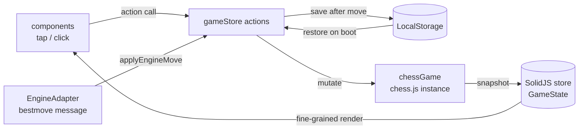
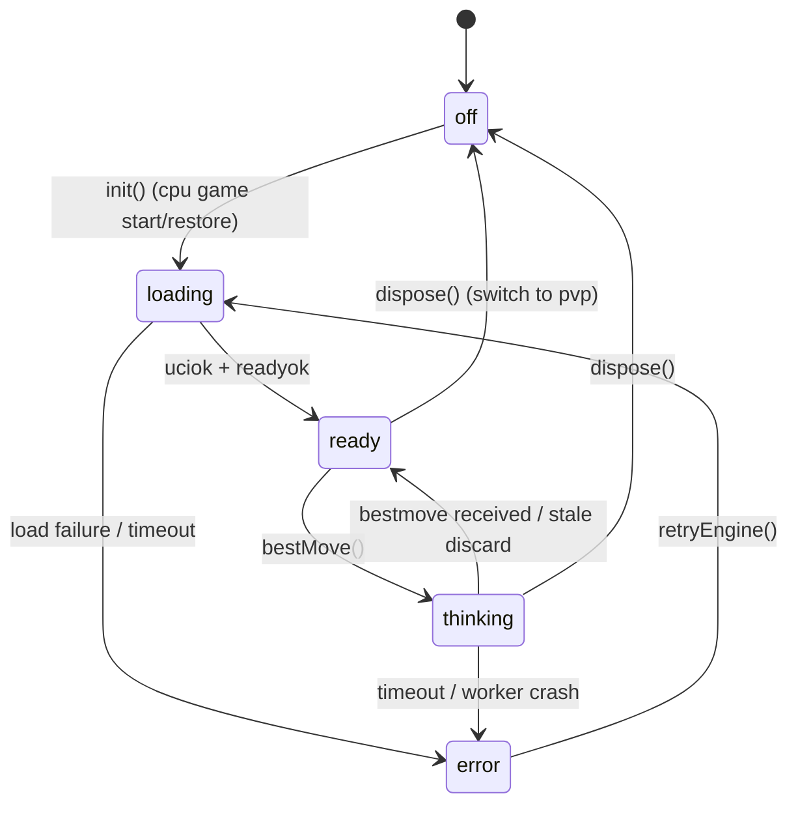

# 02. 状態管理と永続化

## 1. 単方向データフロー

すべての状態変更は store の action を経由する。UI・エンジン・復元処理のいずれも直接 store を書き換えない。



規約: **chess.js が真実の源、store はその投影**。局面・合法手・終了判定を store 側で二重管理しない。action は「chessGame を操作 → スナップショットを取得 → store に反映 → 保存」の順で処理する。

## 2. 共有型定義(`src/game/types.ts`)

```ts
import type { Color, PieceSymbol, Square } from "chess.js"; // "w"|"b", "p"|"n"|"b"|"r"|"q"|"k", "a1".."h8"

export type GameMode = "pvp" | "cpu";
export type Difficulty = "easy" | "normal" | "hard" | "master";

export type GameStatus =
  | { kind: "playing"; check: boolean }
  | { kind: "checkmate"; winner: Color }
  | { kind: "stalemate" }
  | { kind: "draw"; reason: "threefold" | "insufficient" | "fifty-move" }
  | { kind: "resigned"; winner: Color };

export interface BoardPiece {
  square: Square;
  type: PieceSymbol;
  color: Color;
  /** Stable identity for move animation. Format: `${color}${type}-${n}` (n = spawn order). */
  id: string;
}

export interface HistoryEntry {
  san: string;
  from: Square;
  to: Square;
  color: Color;
  captured?: PieceSymbol;
}

export interface GameConfig {
  mode: GameMode;
  /** cpu mode only; ignored in pvp. */
  difficulty: Difficulty;
  /** Human side in cpu mode; ignored in pvp. */
  playerColor: Color;
}

export type EngineState = "off" | "loading" | "ready" | "thinking" | "error";

export interface GameState {
  config: GameConfig;
  fen: string;
  turn: Color;
  /** All pieces currently on the board (not an 8x8 matrix — flat list keyed by id). */
  pieces: BoardPiece[];
  history: HistoryEntry[];
  status: GameStatus;
  /** Interaction state (05 参照). Never persisted. */
  selected: Square | null;
  legalTargets: Square[];
  pendingPromotion: { from: Square; to: Square } | null;
  lastMove: { from: Square; to: Square } | null;
  engine: EngineState;
}
```

補足:

- `pieces` を 8×8 行列でなくフラット配列 + 安定 `id` にするのは、SolidJS の `<For>` で駒の同一性を保ち、CSS transition による移動アニメーションを成立させるため([04](04-components-styling.md) §5)。`id` は `chessGame.ts` が chess.js の move 結果(from/to/captured/promotion/キャスリングのルーク移動)を追跡して維持する。プロモーション時は新しい `id` を発番する(駒種が変わるため)。
- `selected` / `legalTargets` / `pendingPromotion` は UI 一時状態であり、**永続化しない**。

## 3. chessGame ラッパー API(`src/game/chessGame.ts`)

chess.js を唯一 import するモジュール。クラスまたはクロージャーで実装し、以下を公開する。

```ts
export interface MoveResult {
  entry: HistoryEntry;
  snapshot: Snapshot;
}

export interface Snapshot {
  fen: string;
  turn: Color;
  pieces: BoardPiece[];
  status: GameStatus; // resigned は含まない(store 側で上書き)
  pgn: string;
}

export interface ChessGame {
  reset(): Snapshot;
  loadPgn(pgn: string): Snapshot;              // throws on invalid PGN
  legalTargets(from: Square): Square[];        // 空配列 = 選択不可
  isPromotion(from: Square, to: Square): boolean;
  move(from: Square, to: Square, promotion?: PieceSymbol): MoveResult; // throws on illegal
  moveUci(uci: string): MoveResult;            // "e2e4" / "e7e8q" 形式(エンジン応答用)
  history(): HistoryEntry[];
  capturedBy(color: Color): PieceSymbol[];     // history から導出
}
```

終了判定のマッピング: `isCheckmate → checkmate(winner = 直前に指した側)`、`isStalemate → stalemate`、`isThreefoldRepetition → draw/threefold`、`isInsufficientMaterial → draw/insufficient`、`isDrawByFiftyMoves → draw/fifty-move`。判定順は checkmate → stalemate → draw の順。

## 4. store と action(`src/store/gameStore.ts`)

`createStore<GameState>` を用い、`createGameStore(engineFactory: () => EngineAdapter)` ファクトリーとして実装する(テスト時にモックエンジンを注入するため)。アプリでは `createContext` は使わず、`GameContainer` で生成して props 経由で子に渡す(コンポーネント階層が浅いため Context は不要)。

| Action | 処理内容 |
| --- | --- |
| `boot()` | 起動時に 1 回。保存データがあれば復元(§6)、なければ NewGameDialog を開くための初期状態(`status.kind: "playing"` の初期局面、`mode: "pvp"`)にする |
| `newGame(config)` | chessGame.reset → store 全置換 → 保存 → CPU が先手なら `requestEngineMove()` |
| `tapSquare(sq)` | 選択/移動のインタラクション処理([05](05-interaction-flows.md) §2 の状態遷移表に厳密に従う) |
| `confirmPromotion(piece)` | `pendingPromotion` を使って move 実行 → `afterMove()` |
| `cancelPromotion()` | `pendingPromotion` と選択状態をクリア |
| `resign(color)` | `status = { kind: "resigned", winner: 逆色 }` → 保存 |
| `requestEngineMove()` | `engine = "thinking"` → `adapter.bestMove(fen, difficulty)` → 成功時 `applyEngineMove(uci)` / 失敗時 `engine = "error"` |
| `applyEngineMove(uci)` | chessGame.moveUci → `afterMove()`。応答時に対局が変わっていたら破棄([03](03-engine.md) §5) |
| `retryEngine()` | error 状態からの再試行: `init()` からやり直し、CPU 手番なら `requestEngineMove()` |

共通後処理 `afterMove(result)`(private): スナップショットを store に反映 → `lastMove` 更新 → 選択状態クリア → 保存(§5)→ 対局継続中かつ CPU の手番なら `requestEngineMove()`。

## 5. 永続化スキーマ(`src/persistence/schema.ts`, `storage.ts`)

- **キー**: `"chess-web.save.v1"`
- **保存タイミング**: 毎手番確定後・投了時・新規対局開始時(初期局面を保存)。
- **削除タイミング**: なし(常に最新対局で上書き)。

```ts
export interface SavedGameV1 {
  version: 1;
  savedAt: string; // ISO 8601
  config: GameConfig;
  pgn: string;     // full move history — restore by replaying
  /** Only when the game ended by resignation (not representable in PGN). */
  resignedBy?: Color;
}
```

`storage.ts` の公開 API: `saveGame(data: SavedGameV1): void` / `loadGame(): SavedGameV1 | null` / `clearGame(): void`。

`loadGame()` のバリデーション: JSON.parse 失敗、`version !== 1`、`config`/`pgn` フィールドの型不一致のいずれかで `null` を返し、`clearGame()` して console.warn。将来スキーマを変える場合は `version` を上げ、`loadGame` 内でマイグレーションする方針(現時点では v1 のみ)。

## 6. 復元フロー(`boot()`)

```mermaid
sequenceDiagram
    participant App
    participant Store as gameStore.boot()
    participant P as storage
    participant G as chessGame
    participant E as EngineAdapter
    App->>Store: boot()
    Store->>P: loadGame()
    alt saved data valid
        P-->>Store: SavedGameV1
        Store->>G: loadPgn(pgn)
        G-->>Store: Snapshot
        Store->>Store: apply snapshot + resignedBy override
        alt cpu mode & playing & engine turn
            Store->>E: init() then bestMove(fen)
            Note over Store,E: UI is interactive immediately;<br>engine=loading→thinking meanwhile
        end
    else null (missing / corrupted)
        P-->>Store: null
        Store->>G: reset()
        Store->>Store: open NewGameDialog
    end
```

`loadPgn` が throw した場合(保存データは形式的に有効だが PGN が壊れている)も破損扱い: `clearGame()` → 新規対局ダイアログへフォールバック。**いかなる保存データの状態でもアプリが起動不能になってはならない。**

## 7. エンジン状態マシン



`engine === "thinking"` の間、人間側の入力は「盤面の閲覧・履歴スクロール・投了・新規対局」のみ許可し、駒の選択は無視する([05](05-interaction-flows.md) §4)。
