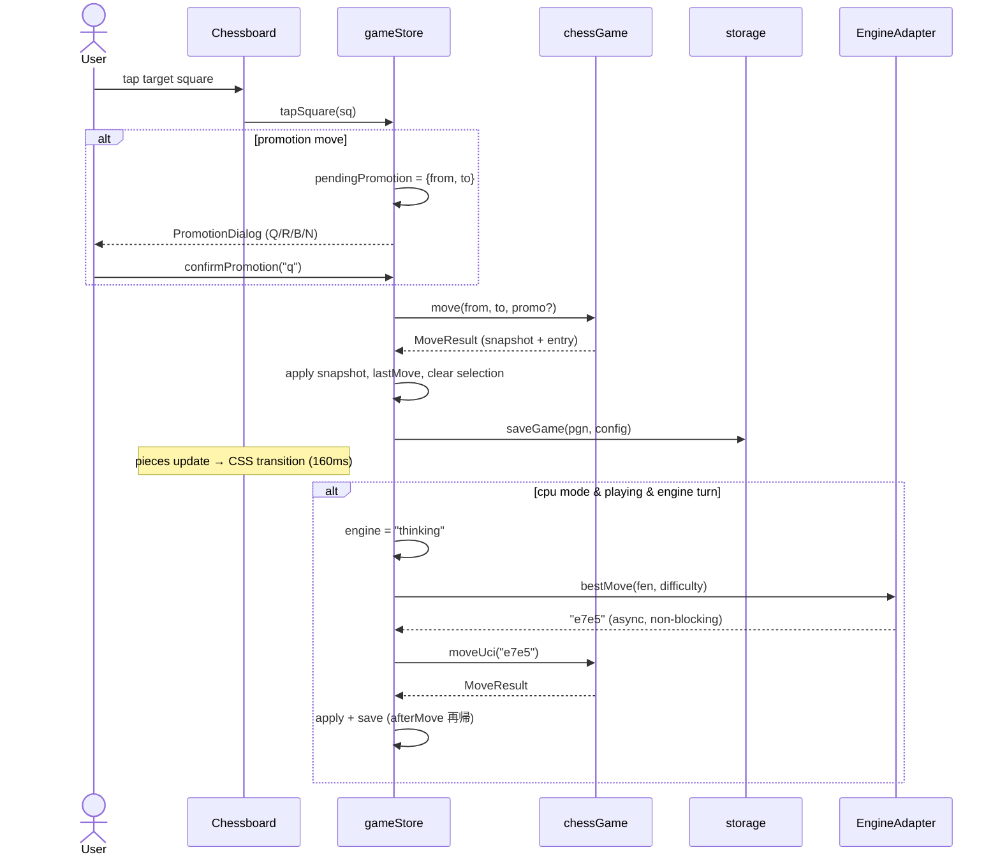

# 05. ゲームループとインタラクション

## 1. 入力方式

**二回タップ(two-tap)方式のみ**を実装する。1 タップ目で駒を選択し合法手をハイライト、2 タップ目で移動先を確定する。ドラッグ&ドロップは実装しない(モバイルでのスクロール競合・誤操作を避け、実装をシンプルに保つ)。クリックも同一コードパスで扱う(`pointerdown` ではなく `click` イベントを使用し、タップ/クリックを区別しない)。

## 2. タップの状態遷移(`tapSquare(sq)` の仕様)

前提条件: `status.kind === "playing"` かつ入力ロック中でない(§4)こと。満たさないタップは無視する。

| # | 現在の状態 | タップ対象 | 遷移 |
| --- | --- | --- | --- |
| 1 | 未選択 | 手番側の自駒 | 選択: `selected = sq`, `legalTargets = chessGame.legalTargets(sq)` |
| 2 | 未選択 | 空マス / 相手駒 | 何もしない |
| 3 | 選択中 | `legalTargets` 内のマス | **移動確定**(§3)。ただしプロモーションなら `pendingPromotion` をセットしダイアログ表示 |
| 4 | 選択中 | 手番側の別の自駒 | 選択の付け替え(#1 と同じ処理)|
| 5 | 選択中 | 選択中の駒自身 | 選択解除: `selected = null`, `legalTargets = []` |
| 6 | 選択中 | 上記以外(非合法マス) | 選択解除 |

- 合法手が 0 の自駒(ピン等)も #1 で選択でき、ハイライトが空になることで「動けない」ことを伝える。
- キャスリングはキングの 2 マス移動(`e1 → g1` 等)として `legalTargets` に現れる。アンパッサンも通常の斜め移動として現れる。**UI に特別な分岐は不要** — chess.js の move 結果がルーク移動・ポーン除去を含み、`pieces` スナップショット更新(+ CSS transition)で自動的に正しく表現される。

## 3. 移動確定シーケンス(人間の手)

- プロモーションダイアログでキャンセル(overlay タップ / Esc)した場合は `pendingPromotion` と選択を両方クリアし、手番は変わらない。
- `chessGame.move()` が throw することは状態遷移表上ありえない(#3 は legalTargets 検証済み)。throw したら実装バグなのでそのまま例外を伝播させる(握りつぶさない)。

## 4. 入力ロック規則

以下のとき `tapSquare` は駒の選択・移動を受け付けない(no-op):

- `engine === "thinking"` または `engine === "loading"`(CPU 応答待ち)
- CPU 戦で人間側の手番でないとき(`turn !== config.playerColor`)
- `status.kind !== "playing"`(終局後)
- `pendingPromotion !== null`(ダイアログ表示中 — kobalte のモーダルが実質ブロックする)

ロック中も常に可能な操作: 履歴スクロール、New Game、Resign(人間側のみ、`playing` 中のみ)、エンジン Retry。CPU 思考中の視覚表現: GameStatusBar のスピナー + 文言のみ。**盤面を暗転させたりオーバーレイを被せたりしない**(閲覧を妨げない)。

## 5. 視覚フィードバック一覧

| 状態 | 表現(トークンは [04](04-components-styling.md) §2) |
| --- | --- |
| 選択中の駒のマス | `--hl-selected` の塗り |
| 合法手(空マス) | 中央に直径 30% の円ドット `--hl-legal-dot` |
| 合法手(捕獲) | マス外周リング(`box-shadow: inset`)`--hl-legal-dot` |
| 直前の手(from/to) | `--hl-last-move` の塗り(CPU の手を人間が追えるよう必須) |
| チェック中のキング | `--hl-check` の塗り(`playing` かつ `check` 時に王のマス) |
| 終局 | GameOverModal(§6)+ lastMove 塗りは残す |

## 6. ゲーム終了フロー

1. `afterMove()` 後の `status.kind` が `playing` 以外になったら、**300ms 遅延**(最後の駒アニメーション完了を待つ)後に GameOverModal を開く。
2. モーダル内容: 結果文言([04](04-components-styling.md) §7)+ "New Game" ボタン。
3. モーダルを閉じる(overlay / Esc / ✕)と終局後の盤面を自由に閲覧できる。GameStatusBar には結果文言を表示し続け、"New Game" ボタンから NewGameDialog を再度開ける。
4. 終局状態も保存されるため、リロードしても終局盤面 + 結果表示が復元される。

投了: GameStatusBar の "Resign" ボタン(押下 → ブラウザーネイティブでない kobalte 確認ダイアログ or 単純に即投了か — **確認ステップを挟む**。誤タップで対局が終わるのは品質原則に反する)。確認後 `resign(色)` を実行し、上記 1–4 と同じ流れ。CPU 戦では常に人間側の投了として扱う。PvP では現在手番側の投了とする。

## 7. 新規対局フロー

1. "New Game" → NewGameDialog(進行中の対局がある場合、ダイアログ内に "Current game will be discarded" の注意書きを表示)
2. mode / difficulty / playerColor(White・Black・Random)を選択して "Start"
3. `newGame(config)`: 進行中のエンジン思考は世代管理([03](03-engine.md) §5)で無効化。PvP 選択時はエンジンを dispose、CPU 選択時は init(未初期化なら)
4. CPU 戦で人間が黒(または Random で黒)なら、盤を黒視点に反転し、直ちに `requestEngineMove()` で白の初手を打たせる

## 8. キーボード操作(アクセシビリティ)

- 盤の各マスは `role="gridcell"` 相当の `<button>` として実装し、Tab/矢印キーで移動、Enter/Space で `tapSquare` と同じ処理を発火する(実装は「64 個の button を grid 配置」で足りる。roving tabindex までは要求しない — Tab 移動で可)。
- 各マスの `aria-label`: `"e4, white knight"` / `"e5, empty"` の形式。選択中は `aria-pressed` を付与。
- Dialog 類のフォーカストラップは @kobalte/core が担う。
